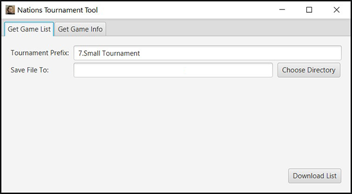
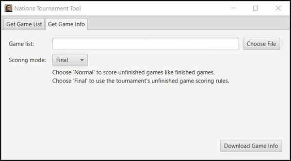

# Nations Tournament Tool

This is a tool for helping manage the MabiWeb Nations "[Small Tournament](https://5f99237e5765c.site123.me/)".

### Usage

This tool expects tournament game names in the following syntax:  `[prefix] - Group [A-Z] - Game [xxx]`.

For example, `7.Small Tournament - Group A - Game 105`.

Before running the tool, all games for the tournament should already be created. Each game should have 3 players.

The tool has two tabs:  

#### Get Game List Tab

Enter the prefix to generate a file containing the list of games to track for the tournament.

This can only find games that were active within the last 30 days since MabiWeb deletes inactive games after that point.

#### Game Info Tab

Provide a file containing the list of games to track for the tournament.  This can either be the file generated in the `Get Game List` tab, or the one generated by this tab.

The scoring mode determines how tournament scores are calculated.  In "Normal" mode, unfinished games are scored like finished games.  In "Final" mode, unfinished games are scored as unfinished matches per the [tournament's rules](https://5f99237e5765c.site123.me/).

Click the `Download Game Info` tab to generate a file containing all the data on the current games in the tournament.
